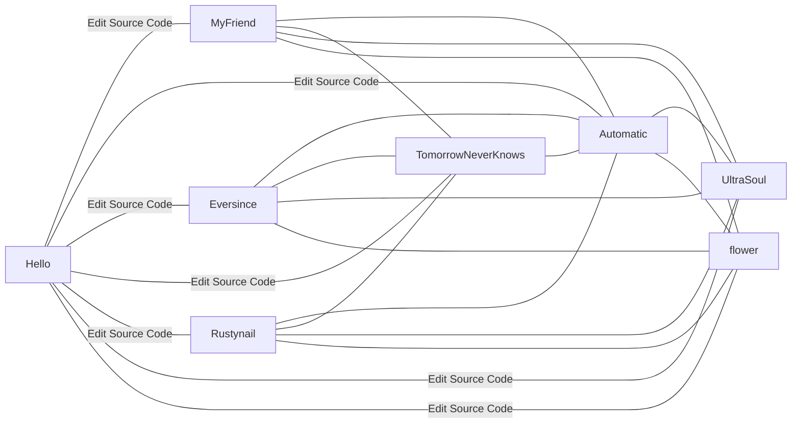

### Introduce:
#### 👋 Hi, I’m @t-kyn-git
* I’m a passionate developer with a strong interest in innovative IT solutions to make everyday life more efficient, aiming for fileless and paperless home automation. My approach focuses on sustainable, streamlined systems that leverage lightweight, optimized technologies.

### Interests:
#### 🏀 Basketball
* NBA
* B-league
#### ⚽ Soccer
* premier league
* MZV
#### 🖥️ Exploring all facets of information technology
#### 🔍 Keen to learn and implement practical solutions for day-to-day life and digital transformation

### experience:
#### 💻technology
* container
    * Kubernetes,minikube,k3d,k3s
    * docker,ansible
* HA
    * Peacemaker,clsterpro
* MAIL,DNS...
    * squid,bind,postfix,opendkim
* database
    * MySQL,Oracle19c,PostgreSQL
* application middleware
    * tomcat,apache,nginx,python
* monitoring tools
    * zabbix,git,sftp,jp1,senju
* git
    * github,gitlab,githubactions
* CMS
    * Wordpress,LAMP,nextcloud
* BI tools:
    * metabase,grafana,fluentd,prometheus
* cloud:
    * OCI,AWS,localstack,tflocal
#### 🤖skills
* member management as a team leader.
* Man-Hour Management
* trouble shootings
* customer negotiation
#### 💼Business knowledge
* Mainly infrastructure non-functional requirements
 (operation, etc.) and business requirements.

### Currently Learning and Working On:
* Deepening knowledge across various IT domains, 
* especially in containerization, cloud infrastructure, and automation
* Experimenting with Alpine-based container images for efficient memory usage in lightweight applications

### Looking to Collaborate On:
* Paperless, fileless home environments
* Open-source projects with a focus on automation, containerized deployments, and efficient infrastructure management

### Ongoing Projects (Portfolio):
* This shows the whole system. since the detail is the private infomation, the description is by using a J-pop metaphor.
* The current planning may be change.
* https://t-kyn-git.github.io/t_kyn_bish_the_test/

#### MyFriend(Frontsrv)
 * Reason for naming
    * The phrase "always shining" means to increase the value of the flie serve and static website hosting.
 * Technologies: 
    * Java(moved to old)
    * Go(moved to old)
    * MongoDB(moved to old)
    * RabbitMQ(moved to old)
    * Typescript(moved to old)
    * Nginx
    * nextcloud
    * mariadb
 * Focus: 
    * Migrating to lightweight
    * optimized container images for better performance
 * Site:
    * private only
 * Repository:
    * Private only
#### Automatic(OCR + Private File Management)
 * Reason for naming
    * Because we want to automate the process rather than just manage documents
 * Technologies: 
    * python
    * pptx,xlsx,docx,txt
 * Focus: 
    * All Document files.
    * sensitive files.
 * Site:
    * private only
 * Repository:
    * Private only
#### flower(Ansible)
 * Reason for naming
    * Because Ansible is like carefully build up invisible elements to create a beautiful, harmonious result.
 * Technologies: 
    * Docker-compose
    * Ansible
 * Focus:
    * Docker-Compose + Ansible Deployment
    * Tooling with Docker-Compose
    * Automated and simplified infrastructure setups
 * Site:
    * https://qiita.com/t_kyn/items/090f1b32c89f60186773
 * Repository:
    * Private only
#### Rustynail(Luanti)
 * Reason for naming
    * Because A rusted nail, a rose drawn on fragments of memory, and Luanti all symbolize the beauty found in brokenness and the silent strength of forgotten things.
 * Technologies:
    * Docker-compose
    * Minetest Game
 * Focus:
    * Docker-Compose + Minetest Server
    * A setup to deploy Minetest, a voxel game engine
    * within a containerized environment
 * Site:
    * https://qiita.com/t_kyn/items/88a7e1fe7808bc21df7f
 * Repository:
    * Private only
#### UltraSoul(Google Colab and Cisco Network Packet Tracer Files)
 * Reason for naming
    * the fusion of Google Colab's limitless computation and Cisco Packet Tracer's structured connectivity—where raw power meets precise orchestration.
 * Technologies: 
    * Python
    * Google Colaboratory
    * Cisco Network Packet Tracer
 * Focus:
    * Python-based experiments
    * code snippets for machine learning and data processing
    * Network Configurations
 * Site:
    * Private only
 * Repository:
    * Private only
#### Eversince (bish_the_test)
 * Reason for naming
    * between Terraform’s infrastructure as code and Django’s elegant backend—laying foundations and building dreams in perfect sync.
 * Technologies: 
    * GitHub Actions
    * Terraform
 * Focus:
    * Infrastructure Automation Testing
    * Integrates GitHub Actions
    * Terraform to create reproducible infrastructure environments
 * Site:
    * https://qiita.com/t_kyn/items/1f7ad629fd15d534a083
    * https://t-kyn-git.github.io/t_kyn_bish_the_test/
 * Repository:
    * https://github.com/t-kyn-git/t_kyn_bish_the_test
#### TomorrowNeverKnows(K3d Infrastructure Stack)
 * Reason for naming
    * For the Expection of the future. For not forget the issues.
 * Technologies: 
    * MySQL
    * Python
    * Nginx
    * k3d
    * Prometheus
    * Grafana
    * Fluentd
 * Focus: 
    * End-to-end monitoring
    * Observability within a k3d (Kubernetes-in-Docker) setup
    * Household management
 * Site:
    * Private only
 * Repository:
    * Private only

### 📫 Contact
 * Currently, I don’t have direct contact available, but you can follow my work on GitHub.
