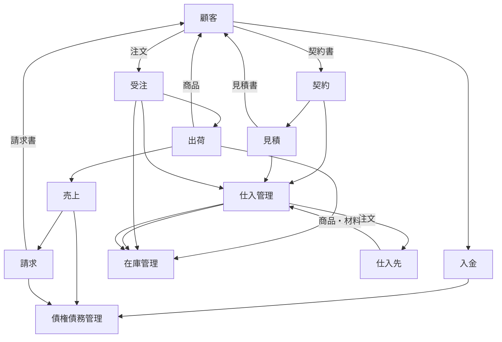

## 目的
Sierを経験するなかで、開発ツールやプロセスなどの技術力を求めることが多く、
ビジネス理解力を活かす機会が比較的少なかったが、
システム全体像をビジネスの視点で把握することが、システムの提案や仕様取りまとめに活用できるのではないか思い、業務知識をつけていきたいと考えている。
また、エンジニア市場では、技術力のみならず、ビジネス変革に対応できる人材が求められている。

こうした状況を踏まえて、少しでもシステム全体を俯瞰できる視点を身に着け、
未経験の業界に関するシステム開発でも対応できるよう予備知識をつけるのが狙い。

## 前提
ビジネス理解力で必要な業務知識は、大きく分けると2つある。

* **共通の業務知識・業種別の業務知識**
* 企業情報・顧客業務知識
このうち、後者は企業等で従事していくなかで、ステークホルダーへのヒアリングやドキュメント等を確認する必要があり、まとめていくのは不可能ですので、前者のみをまとめていく。

また、システムの特性やアーキテクチャに関するケーススタディがあれば追加していく。
（具体的にはAWSやAzure等のパブリッククラウドの導入例を参考URLとして追記していき、業務課題点や工夫した点の記事を取り上げていく。）

※共通の業務知識・業種別の業務知識の内容は、後述のURLや書籍を参考に記載している。

## 共通の業務知識

### 販売管理
* 販売管理の業務の流れの要点
    * 顧客と契約（書類含めて）をし、見積書を顧客に提示
    * 顧客からの注文を受け
        * 在庫あり⇒出荷
        * 在庫なし⇒仕入れ先発注、工場製造を経て出荷
        * 仕入れ先に注文し、仕入れ先から商品／材料を
    * 売上額を会計に計上
    * 顧客へ商品代金請求と入金処理を行う
    * 製造業の場合、設計・納期

* 販売パターン
各販売パターンにおける主なITの内容までまとめると下記の認識。
異なる販売形態や業界によって、使用されるITシステムやツールが異なります。下記は一般的な例であり、実際の企業においては業務の特性に応じてシステムが選択されることがある。

| 販売パターン     | 企業例             | 業務の流れ                                               | 主なITの内容                                      |
|------------------|--------------------|-----------------------------------------------------------|-----------------------------------------------------|
| 在庫販売         | 家電メーカー       | 契約 → 見積 → 受注 → 出荷 → 売上 → 請求 → 入金           | ERPシステム（在庫管理、受注管理、財務管理）        |
| 店頭販売         | スーパー           | 受注管理 → 売上・出荷 → 請求                               | POSシステム（受注・売上管理）、会計ソフト        |
| 受注生産         | 製造業             | 設計・納期確認の契約 → 受注 → 生産 → 出荷 → 請求 → 入金 | MRPシステム（生産計画）、CRMシステム、ERPシステム |
| 預託品販売       | 小売店             | 商品預託 → 販売 → 請求 → 入金                             | POSシステム、在庫管理システム                       |
| 仕入先直送       | ECプラットフォーム | 注文 → 仕入先へ発注 → 仕入先直送 → 請求 → 入金             | ECプラットフォーム、EDI、在庫管理システム           |

#### 受注管理
* CTI（電話やFAXとコンピュータとを統合したシステム）や営業員による入力では誤入力・大量注文への対応が困難のため、EDI、Web-EDI（電子データ取引）を活用した事例が増えている。
* 受注残管理（受注から出荷までの在庫数を管理）

#### 在庫管理
* 引当：在庫から商品を引き当て、顧客の注文に対応するための準備（－）を行います。
* 入庫：新しい商品や資材を保管場所に収め、在庫として登録（＋）します。
* 出庫：在庫から商品を取り出し、顧客への発送や販売準備（－）を行います。

* 在庫評価法
在庫評価する方法として、下記参考記事がわかりやすかった。
各計算方法は在庫の変動や物価変動に対する影響もある。
企業の業績や状況に応じて適切な方法を選択することが重要。

https://it-trend.jp/inventory_control/article/97-0070#chapter-2

#### 請求・入金管理
* 請求サイクルに応じて請求し、支払期限を翌月のX日（X日は企業による）に設定
    * 締め請求（パターンとしては2パターン）
        * 月末締め：月末までの売上を月末日締め
        * N日締め：当月N日～翌月N日までの売上を締め
    * 都度請求
        * 売上計上の度に請求書を即時発行
        支払期限を翌月のX日（X日は企業による）

### 顧客管理
* 顧客ニーズを把握し、見込み顧客をリピータへの関係に深めていくための活動を目的としている。情報を取得し、分析マーケティング、セールス促進、購入後のフォローが狙い。

* 顧客情報の取得方法
顧客との接点有無により変わる。
    * 顧客と接点あり：小売業・サービス業
        * ポイントカード
        （名前と住所を書くことで、POSシステムなどと組み合わせて購入履歴を取得）
    * 顧客と接点なし：製造業など
        * WebサイトやFAXで保証登録
    
* 顧客情報の取扱いについて
    * 個人情報保護法に従って、取扱者は厳密な情報管理が必要。
        * 利用目的の通知
        * 安全管理措置（情報漏洩防止）
        * 第三者提供の制限（不同意で第三者への提供をしないこと）
        * 利用停止（本人申出で利用停止・削除措置を行う）

* 分析マーケティング
    * 顧客分析の方法
    * RFM分析
        * 販売促進策を検討する場面で使うため
        * Recentry：最新購買日／Friquency：頻度／Momentary：金額
        * 優良顧客分析：F高とM高。多利益もたらす。
        * 顧客関係分析：F高、R低。離反の可能性高。
    * 顧客セグメント分析
        * いつ、何が売れるか・どのようにアプローチするかを導くため、
        顧客属性や購入履歴から顧客をいくつかのセグメントに分類
        
* セールスプロモーション
    * 商品とターゲットを決めたらDMなどで販売促進する
    * 例えば、費用対効果の高いキャンペーンを実施するには、結果測定・分析が必要で以下のシステム対応が必要。
        * キャンペーン計画のコードを紐づけ
        * 販売管理システム：キャンペーン販売を識別する仕組み導入
        * 購買管理システム：キャンペーン支出を識別する仕組み導入
        * 管理会計システム：キャンペーンコード指定し、
        　　　　　　　　　　売上、値引、販売促進費など一連の会計伝票の収集分析できる仕組みの構築
    * プロモーションミックスの活用
        * 宣伝、販売促進、手法を複合的に活用していく。
    * 商品提案
        * インターネット販売で顧客に買ってもらう環境を作るために必要な機能

* 購入後フォロー
  コスト負担であるが、第２の販売機会でもある。
    * コンタクトセンター
        * 役割としては、情報発信（アウトバウンド機能）と、情報受信（インバウンド機能）がある。
        * CRM機能
            * 顧客情報や、応対履歴、購入製品の修正履歴管理、FAQ管理などがある。
              例）**Salesforce**
        * CTI機能
            * 着信番号認識、自動音声応答、自動着信振り分け、自動音声録音など。

### 会計
* 会計活動の目的
企業活動で発生したお金の情報を定期的に測定、記録、計算し、結果をステークホルダーに報告するため会計情報に対するニーズはステークホルダーによって異なる。
    * 株主（企業に経営しほんを委託している）
        資本の管理運用状況を把握したい。
    * 投資家
        企業の集英規制や将来性があるか
    * 債権者（企業に融資している）
        適正に利益を獲得していて、返済できる能力があるか
    * 取引先
        事業が安定しているが。資金の流れや財政状態は健全か
    * 税務当局
        課税対象の企業の保有資産。事業年度ごとの所得を把握したい
    * 経営者（ここでは責任者）
        資本を効率よく業務に投入できていて利益が出ているか。資金の流れが適切か。

* 財務諸表
    * 賃借対照表
        保有資産や負債などの金額を示す。財政状態を報告
    * 損益計算書
        事業年度の売上、利益などの金額を示して経営成績を報告
    * キャッシュフロー
        資金の流入量と流出量を示して資金の流れを報告する
    * 企業活動は簿記のルールに従って行う。

* 会計と他の業務
    * 一般会計で仕訳作成、元帳の管理と決算機能・購買・生産・販売・人事などと連携が必要となる。
    * 購買の場合は原材料や商品の発注から受領までの業務を管理。債務管理とも連携する。　　販売管理も同様債務管理と連携ある。
    * 人事管理は給与があるので一般会計と連携がある。
    
### 途中まで更新
後続内容は時間が空き次第更新いたします★

## あとがき
近年では、ChatGPTを利用した生成AIがあります。
業務知識を身に着けることで基本的なビジネスを把握しつつ、
詳細設計、構築・コーディング、テストに関しては、AIを活用することで、
効率的にシステム開発を進める時代が来るかと感じますので、
AIの特性を活かしてビジネス変革に対応できるようにしないといけない危機感を持ちました。
## 

## 参考
* デジタルトランスフォーメーションに必要な技術と人材
https://www.ipa.go.jp/archive/files/000067935.pdf

* 短時間でも効果！ビジネス理解力を高める技

https://xtech.nikkei.com/it/atcl/column/17/120800572/

* 図解でよくわかる SEのための業務知識

https://pub.jmam.co.jp/book/b359433.html

